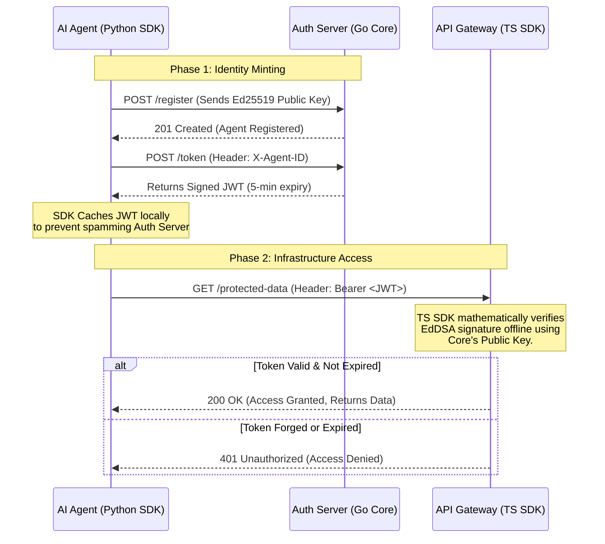

# @agent-auth-protocol/ts-sdk 🛡️

**The official TypeScript verifier for the AgentAuth M2M Protocol.**

Designed for edge networks (Cloudflare Workers, Vercel Edge) and Node.js environments. This SDK allows your API gateways and infrastructure to cryptographically verify short-lived agent JWTs in just two lines of code, preventing unauthorized LLMs from accessing your data.

## Flow



## 📦 Installation

```bash
npm install @agent-auth-protocol/ts-sdk jose
```

## 🚀 Quick Start

```typescript
import { AgentAuthVerifier } from '@agent-auth-protocol/ts-sdk'

// 1. Initialize with your Auth Server's public key (Ed25519)
const verifier = new AgentAuthVerifier(process.env.AGENT_AUTH_PUBLIC_KEY)

// 2. Verify incoming tokens in your API middleware
async function handleAgentRequest(req) {
  const token = req.headers.authorization?.split(' ')[1]

  try {
    const { isValid, agentId } = await verifier.verifyToken(token)
    console.log(`Access granted to agent: ${agentId}`)
    // Proceed with infrastructure execution...
  } catch (error) {
    console.error('Agent verification failed:', error.message)
    // Block access (e.g., return 401 Unauthorized)
  }
}
```

---

_Built for the Agentic Era. Part of the AgentAuth Protocol Suite._
